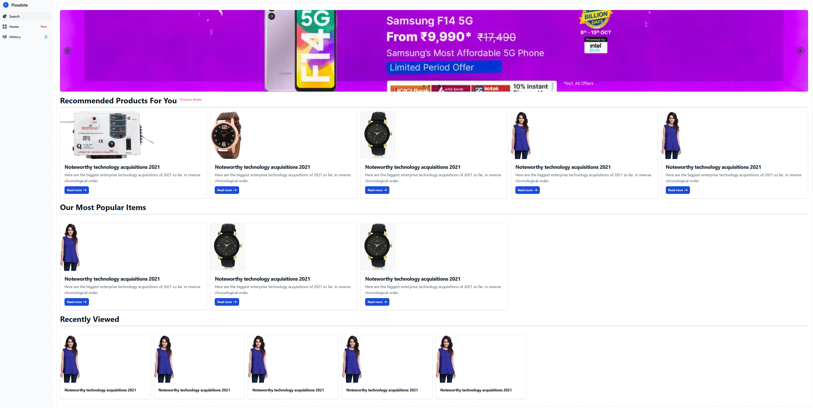
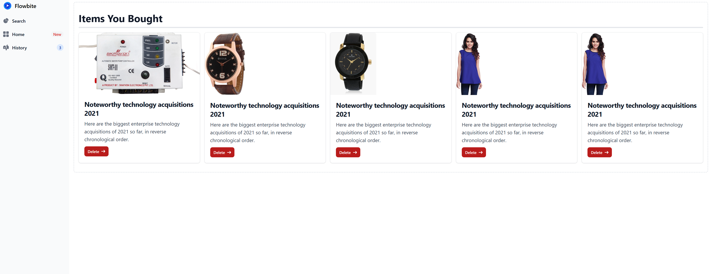
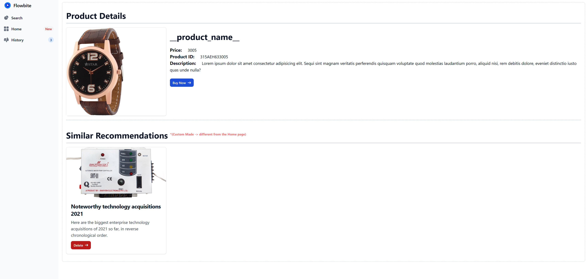
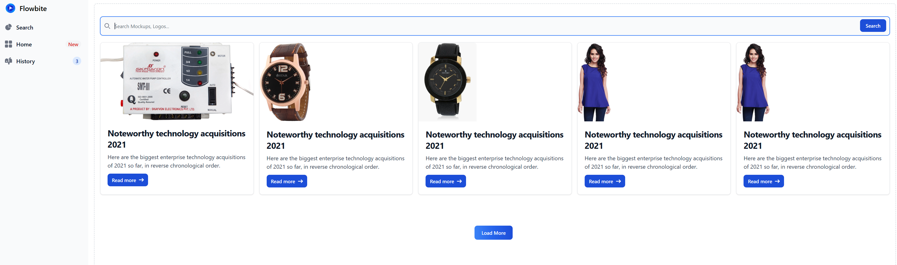

# E-Commerce Recommender Systems

## The Motivations behind This Project

This project was started so as to become an upgraded version of the movie-recommender project that I previously completed. Similar to that project this would recommend products instead of movies, but would be much more developed version of the recommender, as this would include 3 types of recommender

1st – recommends on the basis of user’s buying history

2nd – recommends on the basis of the current viewing product

3rd – recommends on the basis of the shopping trends of the buyer who bought similar products as the current user

This recommender system was supposed to be designed as an API which then could be implement/integrated into other existing e-commerce websites

Pre-Development Ideas - [pdf](./E-Commerce%20Tools.pdf))

> [!NOTE]
> Refer to this `pdf` for additional information 

## Why I archived This Project

To be honest this is something I would pick it up again probably after some time after I gain enough knowledge in recommender systems and how to create a much better version of the existing one. The aim is to create a hybrid recommender which combines various recommender into one, each having its own weight thus fine tuning these weights to get better results. Although existing SaaS such as Shopify provide this service along with a lot others thus could be the biggest risk while continuing this project

## Screenshots

| | |
|:-------------------------:|:-------------------------:|
| Home Page|   Items Bought Previously|  
| Product Details|  Search Page | 

