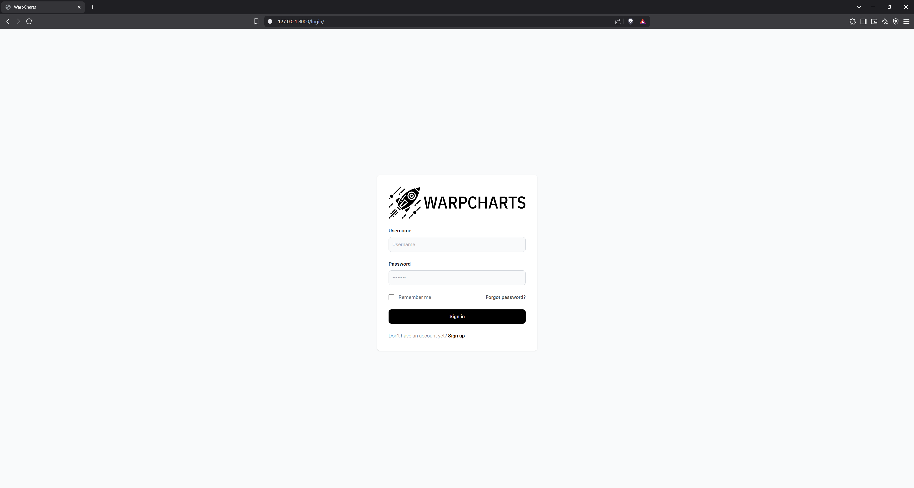
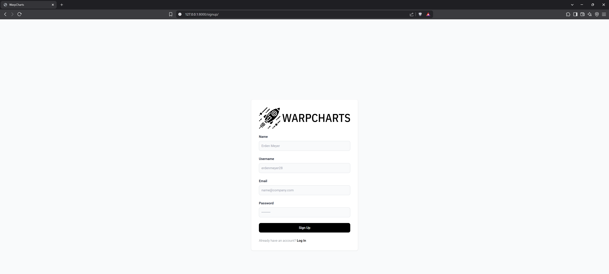
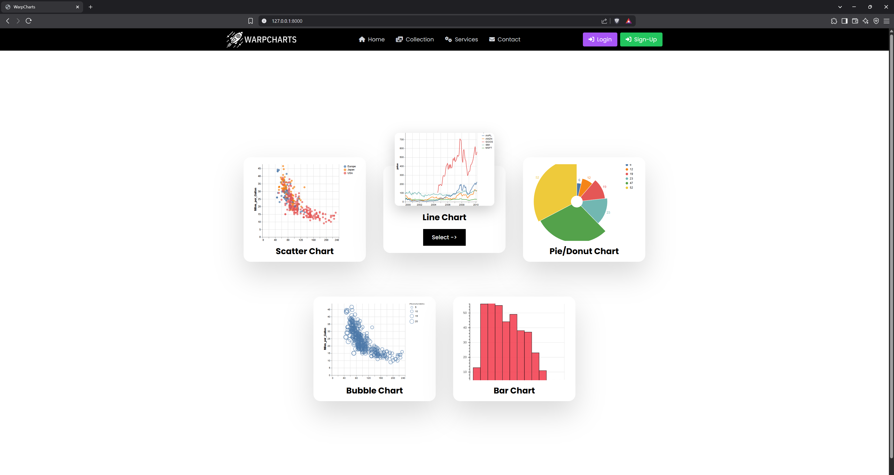
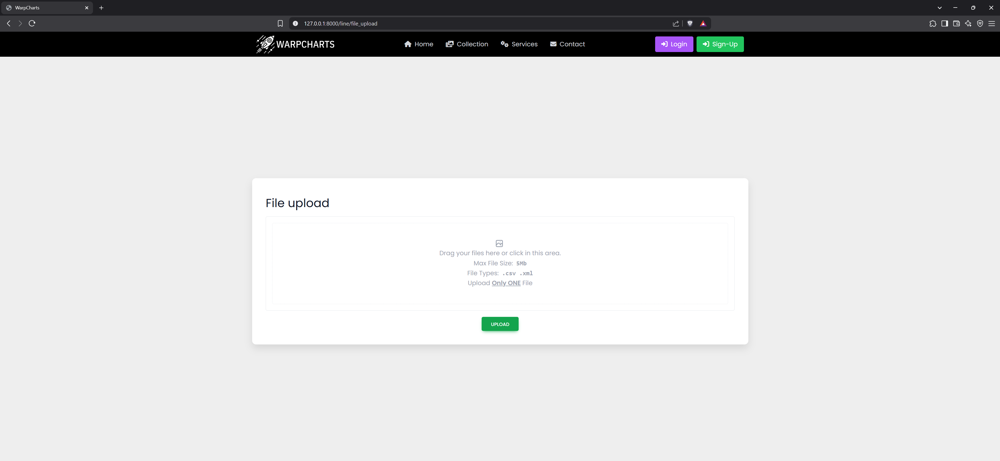
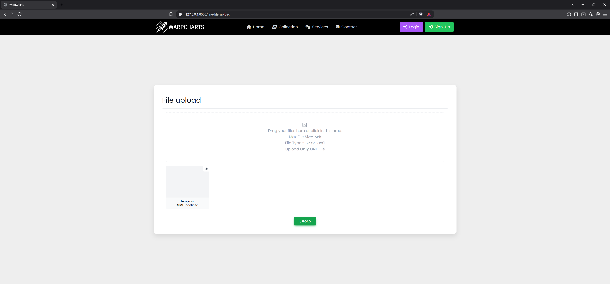
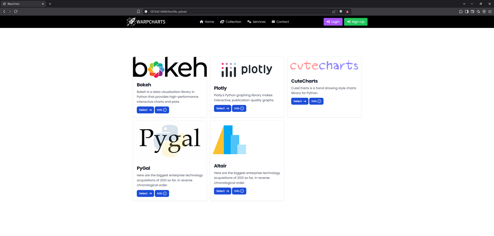

# Project Warpcharts

## The Motivations behind This Project

This would be a chart/graph plotting app, with the aim being to create simple charts from basic inputs and files, also giving the options such as creating unique, beautiful graphs easily (like [cutecharts.py](https://github.com/cutecharts/cutecharts.py))

Most of the front-end has been completed (check at [screenshots](#screenshots)) 

Refer to `pre-development file` [project_warpcharts.pdf](./project_warpcharts.pdf)

## Why I archived This Project

As soon I got working in and designing the overall project, I found out that these simple inputs and plotting became much more complicated due to there being many types of graphs (such as pie chart, bubble, line, function graphs, bar, etc.) thus the simple app that I wanted to design was becoming more complex thus defeating the whole purpose. Therefore I have archived this project as of now, until I find a better way to create the users inputs which make it much simpler and easy than existing solutions such as `MS Excel, MS PowerPoint`, etc.

## Run Locally
Use these followin steps to run this `locally`

- Open ```terminal``` or ```cmd```
- Run 
    ```
    git clone https://github.com/Chronos-Asteri/Archived_Projects
    ```

- Move in the `project_warpcharts/space_warp/` folder then

- Create a python ```env``` and **run** ```python --version``` to check if it is running __Python3__
- Run
  ```
  pip install -r requirements.txt
  ```
- In order to launch the `web-app` run
  
  ```
  python manage.py runserver
  ```
- Open `http://localhost:8000/`

- ℹ️ Also the check the `urls` show in the terminal / cmd

## Screenshots

| | |
|:-------------------------:|:-------------------------:|
| Login Page|   Sign Up Page|  
| Home Page|  File Upload | 
| File Upload (After)| Graphing Frameworks|

